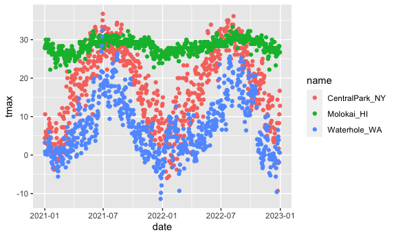
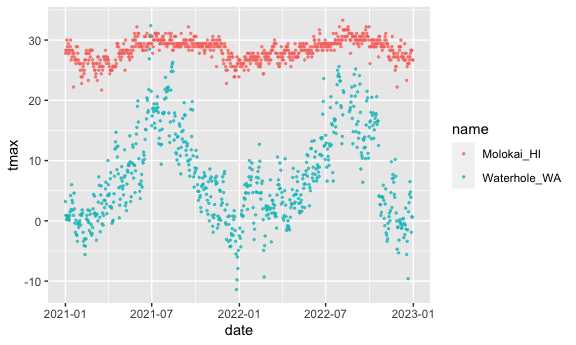
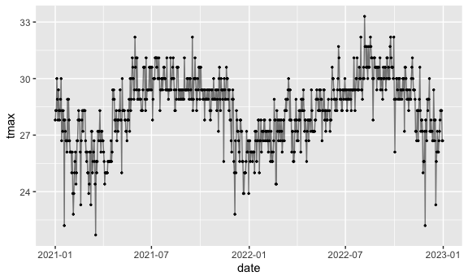
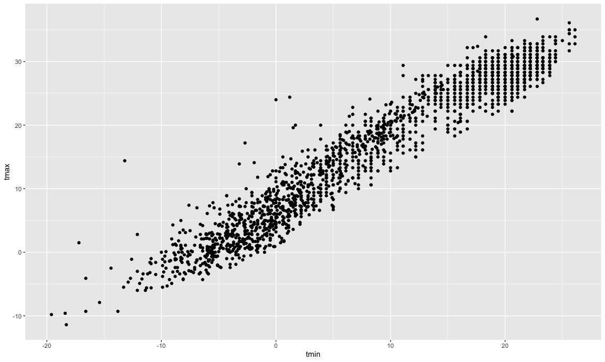
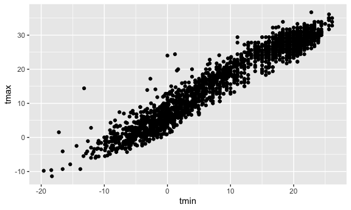

Viz part 1
================
Yingting Zhang
2023-10-08

``` r
library(tidyverse)
```

    ## ── Attaching core tidyverse packages ──────────────────────── tidyverse 2.0.0 ──
    ## ✔ dplyr     1.1.3     ✔ readr     2.1.4
    ## ✔ forcats   1.0.0     ✔ stringr   1.5.0
    ## ✔ ggplot2   3.4.3     ✔ tibble    3.2.1
    ## ✔ lubridate 1.9.2     ✔ tidyr     1.3.0
    ## ✔ purrr     1.0.2     
    ## ── Conflicts ────────────────────────────────────────── tidyverse_conflicts() ──
    ## ✖ dplyr::filter() masks stats::filter()
    ## ✖ dplyr::lag()    masks stats::lag()
    ## ℹ Use the conflicted package (<http://conflicted.r-lib.org/>) to force all conflicts to become errors

``` r
library(ggridges)

knitr::opts_chunk$set(
  fig.width = 6,
  fig.asp = .6,
  out.width = "90%"
)
#set the figure width to be six everywhere and the aspect ratio to be 0.6. And this out width means that it's going to take up 90% of the width of like an html document or a word document.
```

Get the data for plotting today

``` r
weather_df = 
  rnoaa::meteo_pull_monitors(
    c("USW00094728", "USW00022534", "USS0023B17S"),
    var = c("PRCP", "TMIN", "TMAX"), 
    date_min = "2021-01-01",
    date_max = "2022-12-31") |>
  mutate(
    name = recode(
      id, 
      USW00094728 = "CentralPark_NY", 
      USW00022534 = "Molokai_HI",
      USS0023B17S = "Waterhole_WA"),
    tmin = tmin / 10,
    tmax = tmax / 10) |>
  select(name, id, everything())
```

    ## using cached file: /Users/demiwang/Library/Caches/org.R-project.R/R/rnoaa/noaa_ghcnd/USW00094728.dly

    ## date created (size, mb): 2023-10-08 19:41:14.184812 (0.343)

    ## file min/max dates: 2021-01-01 / 2023-10-31

    ## using cached file: /Users/demiwang/Library/Caches/org.R-project.R/R/rnoaa/noaa_ghcnd/USW00022534.dly

    ## date created (size, mb): 2023-10-08 19:41:14.836161 (0.282)

    ## file min/max dates: 2021-01-01 / 2023-10-31

    ## using cached file: /Users/demiwang/Library/Caches/org.R-project.R/R/rnoaa/noaa_ghcnd/USS0023B17S.dly

    ## date created (size, mb): 2023-10-08 19:41:15.23604 (0.122)

    ## file min/max dates: 2021-01-01 / 2023-10-31

``` r
#the things in c is monitor
```

Let’s make a plot!

``` r
ggplot(weather_df, aes(x = tmin, y = tmax)) + geom_point()
```

    ## Warning: Removed 17 rows containing missing values (`geom_point()`).


``` r
#before geom, this just a picture without any plot or data in it, because we dont show what types of plot we want
```

Pipes and stuff

``` r
weather_df |> 
  filter(name == "CentralPark_NY") |> 
ggplot(aes(x = tmin, y = tmax)) + geom_point()
```


``` r
ggp_nyc_weather = 
  weather_df |> 
    filter(name == "CentralPark_NY") |> 
ggplot(aes(x = tmin, y = tmax)) + geom_point()
#this doesnt show the plot, just create a plot data, and need to type ggp_nyc_weather to show the plot
ggp_nyc_weather
```


## Fancy plot

``` r
ggplot(weather_df, aes(x= tmin, y = tmax, color = name)) + geom_point() + geom_smooth()
```

    ## `geom_smooth()` using method = 'loess' and formula = 'y ~ x'

    ## Warning: Removed 17 rows containing non-finite values (`stat_smooth()`).

    ## Warning: Removed 17 rows containing missing values (`geom_point()`).


``` r
# name variable with color
#geom_smooth: fix smooth line with plots (create smooth line)
```

``` r
ggplot(weather_df, aes(x= tmin, y = tmax)) + geom_point(aes(color = name)) + geom_smooth()
```

    ## `geom_smooth()` using method = 'gam' and formula = 'y ~ s(x, bs = "cs")'

    ## Warning: Removed 17 rows containing non-finite values (`stat_smooth()`).

    ## Warning: Removed 17 rows containing missing values (`geom_point()`).


``` r
#mention particular color lines
#the difference between these two codes: the first one is to establish smooth lines everywhere in plots, both to the points and the scatter plot geometry that was making and to the smooth curve that was going through it (have three separate lines with three separate colors). the second one, only the points are being highlighted by color and the smooth is not
```

``` r
ggplot(weather_df, aes(x= tmin, y = tmax)) + geom_point(aes(color = name) , alpha = 0.3) + geom_smooth(se = FALSE)
```

    ## `geom_smooth()` using method = 'gam' and formula = 'y ~ s(x, bs = "cs")'

    ## Warning: Removed 17 rows containing non-finite values (`stat_smooth()`).

    ## Warning: Removed 17 rows containing missing values (`geom_point()`).


``` r
#alpha to make plot more transparent, 0.3, which means 70% ok
```

Plot with facets

``` r
ggplot(weather_df, aes(x = tmin, y = tmax, color = name)) + geom_point(alpha = 0.3) + geom_smooth() +
  facet_grid(. ~ name)
```

    ## `geom_smooth()` using method = 'loess' and formula = 'y ~ x'

    ## Warning: Removed 17 rows containing non-finite values (`stat_smooth()`).

    ## Warning: Removed 17 rows containing missing values (`geom_point()`).


``` r
#there are still too much events, using facet function to show each variable events, using "."to say 'put everything on this row' and ~ name means sepate name to each row (show name in each column)

ggplot(weather_df, aes(x = tmin, y = tmax, color = name)) + geom_point(alpha = 0.3) + geom_smooth() +
  facet_grid(name ~ . )
```

    ## `geom_smooth()` using method = 'loess' and formula = 'y ~ x'

    ## Warning: Removed 17 rows containing non-finite values (`stat_smooth()`).
    ## Removed 17 rows containing missing values (`geom_point()`).


``` r
# this would give three names of rows
```

let’s try a different plot. temps are boring

``` r
ggplot(weather_df, aes(x = date, y = tmax, color = name)) + geom_point(aes(size = prcp), alpha=0.3) + geom_smooth() +
  facet_grid((. ~ name))
```

    ## `geom_smooth()` using method = 'loess' and formula = 'y ~ x'

    ## Warning: Removed 17 rows containing non-finite values (`stat_smooth()`).

    ## Warning: Removed 19 rows containing missing values (`geom_point()`).


try assigning a specific color

``` r
weather_df |> 
  filter(name == "CentralPark_NY") |> 
  ggplot(aes(x = date, y = tmax, color = "blue")) +
  geom_point( )
```


``` r
#one way: adding color =  in geom_point. when you doing the color inside ggplot, this would not do that as you are taking variable in the dataset and mapping them on colors(be careful for this)

# if you have three options:
weather_df |> 
  ggplot(aes(x = date, y = tmax, color = name)) +
  geom_point( )
```

    ## Warning: Removed 17 rows containing missing values (`geom_point()`).



``` r
# if you have two options:
weather_df |>  filter(name != "CentralPark_NY") |>
  ggplot(aes(x = date, y = tmax, color = name)) +
  geom_point( )
```

    ## Warning: Removed 17 rows containing missing values (`geom_point()`).


``` r
#always say alpha size
weather_df |>  filter(name != "CentralPark_NY") |>
  ggplot(aes(x = date, y = tmax, color = name)) +
  geom_point(alpha=0.7, size=0.5 )
```

    ## Warning: Removed 17 rows containing missing values (`geom_point()`).



hex plot

``` r
weather_df |> 
  ggplot(aes(x = tmin, y = tmax)) +
  geom_hex()
```

    ## Warning: Removed 17 rows containing non-finite values (`stat_binhex()`).


``` r
weather_df |> 
  filter(name =="Molokai_HI") |> 
  ggplot(aes(x = date, y = tmax)) + geom_line(alpha=.5)+geom_point(size=0.5)
```

    ## Warning: Removed 1 rows containing missing values (`geom_point()`).



## univariate plotiing

histogram

``` r
ggplot(weather_df, aes(x = tmax, fill = name)) + geom_histogram(position  = "dodge" )
```

    ## `stat_bin()` using `bins = 30`. Pick better value with `binwidth`.

    ## Warning: Removed 17 rows containing non-finite values (`stat_bin()`).


``` r
#position  = "dodge" means avoiding bars would not overlap each other

#if comparing variables, you can use other plot, instead of histogram which is hard to see

ggplot(weather_df, aes(x = tmax, fill = name)) + geom_density(alpha=.3, adjust=.5)
```

    ## Warning: Removed 17 rows containing non-finite values (`stat_density()`).


``` r
#get smooth histogram, good to compare
#adjust to limit condition and change plot??????
```

using boxplots!!!

``` r
ggplot(weather_df, aes(y = tmax, x = name)) + geom_boxplot()
```

    ## Warning: Removed 17 rows containing non-finite values (`stat_boxplot()`).


violin plots?

``` r
ggplot(weather_df, aes(y = tmax, x = name)) + geom_violin()
```

    ## Warning: Removed 17 rows containing non-finite values (`stat_ydensity()`).


ridge plot

``` r
ggplot(weather_df, aes(x = tmax, y = name)) + geom_density_ridges()
```

    ## Picking joint bandwidth of 1.54

    ## Warning: Removed 17 rows containing non-finite values
    ## (`stat_density_ridges()`).


## saving and embedding plots

``` r
ggp_weather = 
weather_df |> 
  ggplot(aes(x = tmin, y = tmax))+ geom_point()

ggp_weather
```

    ## Warning: Removed 17 rows containing missing values (`geom_point()`).


``` r
ggsave("results/ggp_weather.pdf", ggp_weather)
```

    ## Saving 6 x 3.6 in image

    ## Warning: Removed 17 rows containing missing values (`geom_point()`).

``` r
#just name it and save it as the types of file what you want
```

``` r
ggp_weather
```

    ## Warning: Removed 17 rows containing missing values (`geom_point()`).



``` r
#make the picture bigger and heigter, change the size of all picture
```

``` r
ggp_weather
```

    ## Warning: Removed 17 rows containing missing values (`geom_point()`).



``` r
#asep: So how tall the plot is divided by how wide the plot is?

#So 0.6 means a little bit wider than it is tall.
```
