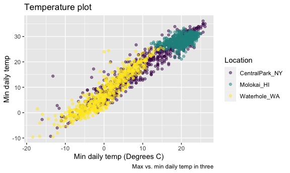

Viz part 2
================
Yingting Zhang
2023-10-08

``` r
library(tidyverse)
```

    ## ── Attaching core tidyverse packages ──────────────────────── tidyverse 2.0.0 ──
    ## ✔ dplyr     1.1.3     ✔ readr     2.1.4
    ## ✔ forcats   1.0.0     ✔ stringr   1.5.0
    ## ✔ ggplot2   3.4.3     ✔ tibble    3.2.1
    ## ✔ lubridate 1.9.2     ✔ tidyr     1.3.0
    ## ✔ purrr     1.0.2     
    ## ── Conflicts ────────────────────────────────────────── tidyverse_conflicts() ──
    ## ✖ dplyr::filter() masks stats::filter()
    ## ✖ dplyr::lag()    masks stats::lag()
    ## ℹ Use the conflicted package (<http://conflicted.r-lib.org/>) to force all conflicts to become errors

``` r
library(patchwork)

knitr::opts_chunk$set(
  fig.width = 6,
  fig.asp = .6,
  out.width = "90%"
)
#set the figure width to be six everywhere and the aspect ratio to be 0.6. And this out width means that it's going to take up 90% of the width of like an html document or a word document.
```

Get the data for plotting today

``` r
weather_df = 
  rnoaa::meteo_pull_monitors(
    c("USW00094728", "USW00022534", "USS0023B17S"),
    var = c("PRCP", "TMIN", "TMAX"), 
    date_min = "2022-01-01",
    date_max = "2023-12-31") |>
  mutate(
    name = recode(
      id, 
      USW00094728 = "CentralPark_NY", 
      USW00022534 = "Molokai_HI",
      USS0023B17S = "Waterhole_WA"),
    tmin = tmin / 10,
    tmax = tmax / 10) |>
  select(name, id, everything())
```

    ## using cached file: /Users/demiwang/Library/Caches/org.R-project.R/R/rnoaa/noaa_ghcnd/USW00094728.dly

    ## date created (size, mb): 2023-10-08 19:41:14.184812 (0.343)

    ## file min/max dates: 2021-01-01 / 2023-10-31

    ## using cached file: /Users/demiwang/Library/Caches/org.R-project.R/R/rnoaa/noaa_ghcnd/USW00022534.dly

    ## date created (size, mb): 2023-10-08 19:41:14.836161 (0.282)

    ## file min/max dates: 2021-01-01 / 2023-10-31

    ## using cached file: /Users/demiwang/Library/Caches/org.R-project.R/R/rnoaa/noaa_ghcnd/USS0023B17S.dly

    ## date created (size, mb): 2023-10-08 19:41:15.23604 (0.122)

    ## file min/max dates: 2021-01-01 / 2023-10-31

``` r
#the things in c is monitor
```

This results in a dataframe with 2007 observations on six variables.

## Same plot from last time

``` r
weather_df |> 
  ggplot(aes(x = tmin, y = tmax, color = name)) + geom_point(alpha=0.5)+ labs(
    title = "Temperature plot",
    x = "Min daily temp (Degrees C)",
    y ="Min daily temp",
    color = "Location",
    caption = "Max vs. min daily temp in three locations; data from rnoaa"
)
```

    ## Warning: Removed 90 rows containing missing values (`geom_point()`).


``` r
# do the label: labs function to x,y and color
#adding message below the x: caption function
#adding title: title function
```

``` r
weather_df |> 
  ggplot(aes(x = tmin, y = tmax, color = name)) + geom_point(alpha=0.5)+ labs(
    title = "Temperature plot",
    x = "Min daily temp (Degrees C)",
    y ="Min daily temp",
    color = "Location",
    caption = "Max vs. min daily temp in three locations; data from rnoaa"
)+
  scale_x_continuous(
    breaks = c(-15,0,15),
    labels=c("-15 C", "0", "15")
  )+
  scale_y_continuous(
    position = "right",
    trans = "sqrt"
  )
```

    ## Warning in self$trans$transform(x): NaNs produced

    ## Warning: Transformation introduced infinite values in continuous y-axis

    ## Warning: Removed 195 rows containing missing values (`geom_point()`).


``` r
#scale:try to modify whatever the default mapping between a variable and the aesthetic that it's mapped onto sort of how those behave

#breaks: where you want to break as exist

#position: move to the place you want (right/left)

#trans function: transfer the numbers to what types of format, like sqrt

#limit function: limit the range you want or you can filter the range by using filter to limit the range value of variables
#like:   filter(tmax >=20, tmax <=30)
```

what about colors…

``` r
weather_df |> 
  ggplot(aes(x = tmin, y = tmax, color = name)) + geom_point(alpha=0.5)+ labs(
    title = "Temperature plot",
    x = "Min daily temp (Degrees C)",
    y ="Min daily temp",
    color = "Location",
    caption = "Max vs. min daily temp in three") + 
  viridis::scale_color_viridis(discrete = TRUE)
```

    ## Warning: Removed 90 rows containing missing values (`geom_point()`).



``` r
 # use viridis color package 
```

what is the utility of scales?

## Themes

``` r
weather_df |> 
  ggplot(aes(x = tmin, y = tmax, color = name)) + geom_point(alpha=0.5)+ labs(
    title = "Temperature plot",
    x = "Min daily temp (Degrees C)",
    y ="Min daily temp",
    color = "Location",
    caption = "Max vs. min daily temp in three") + 
  viridis::scale_color_viridis(discrete = TRUE)+theme_minimal()+
  theme(legend.position = "bottom")
```

    ## Warning: Removed 90 rows containing missing values (`geom_point()`).


``` r
  #theme function to change position
#theme_bw: make the background change to other color, notice! this need to type before theme(change the position), if this take in the end, theme(position) would fail to change

#theme_bw/classic/minimal----change different ways to show pictures
```

## data argument…

``` r
weather_df |> 
  ggplot (aes(x = date, y = tmax, color = name))+ geom_point() + geom_smooth()
```

    ## `geom_smooth()` using method = 'loess' and formula = 'y ~ x'

    ## Warning: Removed 90 rows containing non-finite values (`stat_smooth()`).

    ## Warning: Removed 90 rows containing missing values (`geom_point()`).


``` r
nyc_weather_df = 
  weather_df |> 
  filter(name =="CentralPark_NY")

hawaii_weather_df = 
  weather_df |> 
  filter(name =="Molokai_HI")
```

## `patchwork`

``` r
weather_df |> 
  ggplot(aes(x = date, y = tmax, color = name))+ geom_point()+ facet_grid(.~name)
```

    ## Warning: Removed 90 rows containing missing values (`geom_point()`).


``` r
ggp_temp_scatter = 
  weather_df |> 
  ggplot(aes(x = tmin, y = tmax, color = name))+ geom_point(alpha=0.5)+
theme(legend.position = "none")

ggp_prcp_density = 
  weather_df |> 
  filter(prcp>25) |> 
  ggplot(aes(x = prcp, fill = name))+ geom_density(alpha=0.5)+
theme(legend.position = "none")

ggp_temp_scatter+ggp_prcp_density
```

    ## Warning: Removed 90 rows containing missing values (`geom_point()`).


``` r
#package patchwork can put ggplot pictures next to each other

ggp_tmax_date=
  weather_df |> 
  ggplot(aes(x= date, y=tmax, color=name))+
  geom_point()+geom_smooth(se=FALSE)+theme(legend.position = "bottom")

(ggp_temp_scatter+ggp_prcp_density)/ggp_tmax_date
```

    ## Warning: Removed 90 rows containing missing values (`geom_point()`).

    ## `geom_smooth()` using method = 'loess' and formula = 'y ~ x'

    ## Warning: Removed 90 rows containing non-finite values (`stat_smooth()`).
    ## Removed 90 rows containing missing values (`geom_point()`).


## data manipulation

``` r
weather_df |>
  mutate(
    name = fct_relevel(name, c("Molokai_HI", "CentralPark_NY", "Waterhole_WA"))
  ) |> 
  ggplot(aes(x = name, y= tmax))+geom_boxplot()
```

    ## Warning: Removed 90 rows containing non-finite values (`stat_boxplot()`).


``` r
#control the order of factors

weather_df |> 
  mutate(
    name = fct_reorder(name, tmax)
  ) |> 
  ggplot(aes(x = name, y = tmax, fill=name))+geom_violin()
```

    ## Warning: There was 1 warning in `mutate()`.
    ## ℹ In argument: `name = fct_reorder(name, tmax)`.
    ## Caused by warning:
    ## ! `fct_reorder()` removing 90 missing values.
    ## ℹ Use `.na_rm = TRUE` to silence this message.
    ## ℹ Use `.na_rm = FALSE` to preserve NAs.

    ## Warning: Removed 90 rows containing non-finite values (`stat_ydensity()`).


``` r
#fct_reorder function: you want to put name in order according to some other variable in your data set
#like put name in order according to tamx variable: the first factors is with the lowest average tmax, the second is the one with tne next lowest
```

## complicates FAS plot

``` r
litters_df = 
  read_csv("data/FAS_litters.csv") |> 
  janitor::clean_names() |> 
  separate(group, into = c("dose", "day_of_tx"), sep = 3)
```

    ## Rows: 49 Columns: 8
    ## ── Column specification ────────────────────────────────────────────────────────
    ## Delimiter: ","
    ## chr (2): Group, Litter Number
    ## dbl (6): GD0 weight, GD18 weight, GD of Birth, Pups born alive, Pups dead @ ...
    ## 
    ## ℹ Use `spec()` to retrieve the full column specification for this data.
    ## ℹ Specify the column types or set `show_col_types = FALSE` to quiet this message.

``` r
pups_df=
  read_csv("data/FAS_pups.csv") |> 
  janitor::clean_names()
```

    ## Rows: 313 Columns: 6
    ## ── Column specification ────────────────────────────────────────────────────────
    ## Delimiter: ","
    ## chr (1): Litter Number
    ## dbl (5): Sex, PD ears, PD eyes, PD pivot, PD walk
    ## 
    ## ℹ Use `spec()` to retrieve the full column specification for this data.
    ## ℹ Specify the column types or set `show_col_types = FALSE` to quiet this message.

``` r
fas_df=
  left_join(pups_df, litters_df, by = "litter_number")
fas_df
```

    ## # A tibble: 313 × 14
    ##    litter_number   sex pd_ears pd_eyes pd_pivot pd_walk dose  day_of_tx
    ##    <chr>         <dbl>   <dbl>   <dbl>    <dbl>   <dbl> <chr> <chr>    
    ##  1 #85               1       4      13        7      11 Con   7        
    ##  2 #85               1       4      13        7      12 Con   7        
    ##  3 #1/2/95/2         1       5      13        7       9 Con   7        
    ##  4 #1/2/95/2         1       5      13        8      10 Con   7        
    ##  5 #5/5/3/83/3-3     1       5      13        8      10 Con   7        
    ##  6 #5/5/3/83/3-3     1       5      14        6       9 Con   7        
    ##  7 #5/4/2/95/2       1      NA      14        5       9 Con   7        
    ##  8 #4/2/95/3-3       1       4      13        6       8 Con   7        
    ##  9 #4/2/95/3-3       1       4      13        7       9 Con   7        
    ## 10 #2/2/95/3-2       1       4      NA        8      10 Con   7        
    ## # ℹ 303 more rows
    ## # ℹ 6 more variables: gd0_weight <dbl>, gd18_weight <dbl>, gd_of_birth <dbl>,
    ## #   pups_born_alive <dbl>, pups_dead_birth <dbl>, pups_survive <dbl>

``` r
#what is mean of left_join?????


fas_df |> 
  select(sex, dose, day_of_tx, starts_with("pd")) |> 
  pivot_longer(
    pd_ears:pd_walk,
    names_to = "outcome",
    values_to = "pn_day"
  ) |> 
  drop_na() |> 
  mutate(outcome = fct_reorder(outcome, pn_day)) |> 
  ggplot(aes(x = dose, y = pn_day))+ geom_violin()+
  facet_grid(day_of_tx~ outcome)
```


